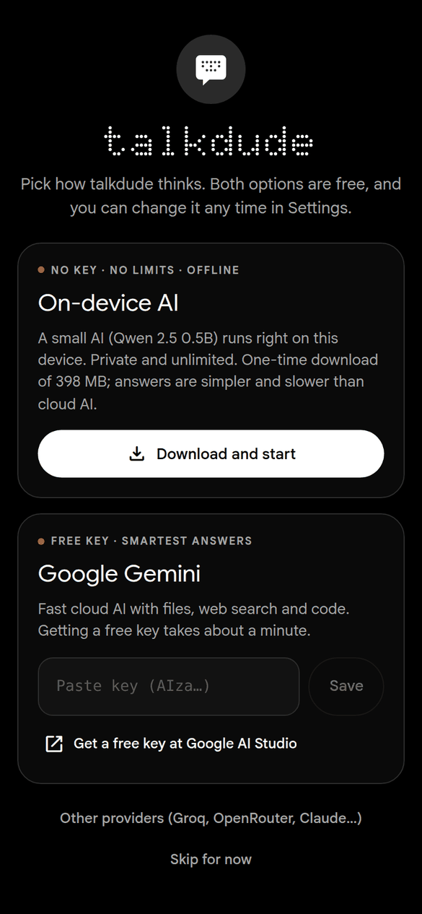
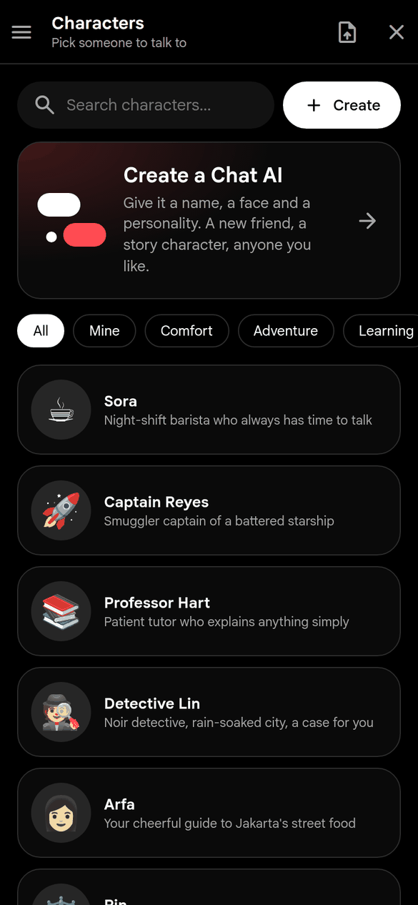
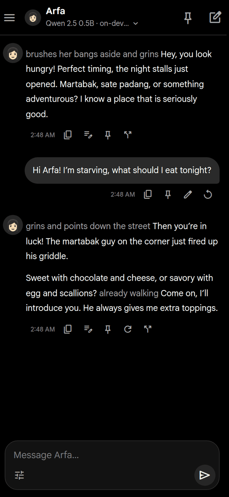
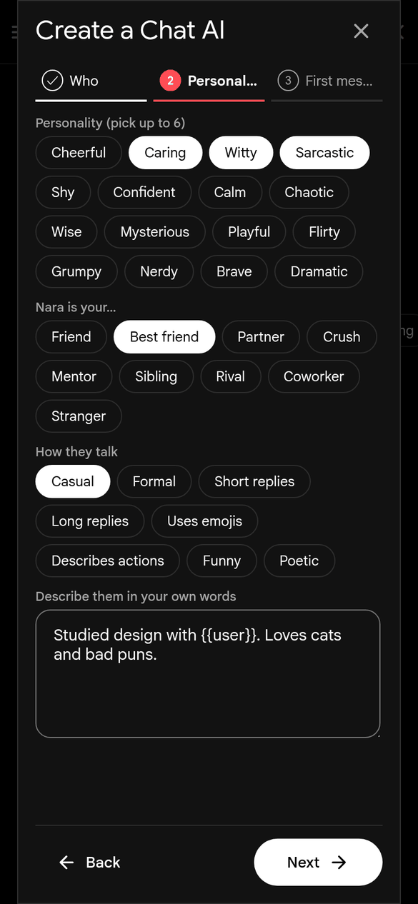
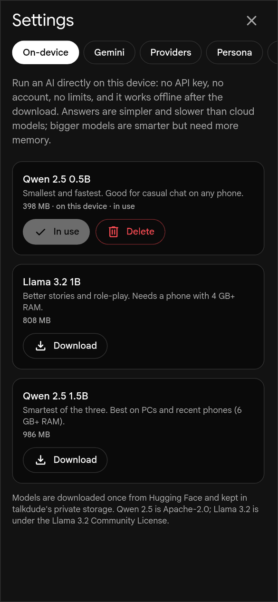

<p align="center">
  
</p>

<h1 align="center">talkdude</h1>

<p align="center">
  A free, private AI chat companion for Android, Windows and Linux.<br/>
  No account. No chat limits. Works offline.
</p>

<p align="center">
  <a href="https://apps.obtainium.imranr.dev/redirect?r=obtainium://app/%7B%22id%22%3A%22io.github.ariastiadi.talkdude%22%2C%22url%22%3A%22https%3A%2F%2Fgithub.com%2FAriastiadi%2Ftalkdude%22%2C%22author%22%3A%22Ariastiadi%22%2C%22name%22%3A%22talkdude%22%7D"></a>
</p>

---

> **New in 1.4: say “save to memory”, and use files, links and web search with any AI.** Earlier, in 1.1: chat without any API key. talkdude can now download a small AI model once and run it right on your phone or PC. No key, no sign-up, no limits, and it keeps working without internet.

<p align="center">
  
  
  
  
  
</p>

## What it does

talkdude is a chat app for talking with AI: ask questions, write, brainstorm, or role-play with characters in the style of Chai and Character.AI. Pick how it thinks on the first launch:

- **On-device AI:** a small open model (Qwen 2.5 or Llama 3.2) runs inside the app. Free, unlimited, private and offline.
- **Cloud AI with your own free key:** Google Gemini, Groq, OpenRouter's free models, or paid providers like OpenAI and Claude.

Your chats are stored only on your device. talkdude has no server of its own.

## Features

- **Works with no key at all.** Download Qwen 2.5 0.5B (398 MB), Llama 3.2 1B (808 MB) or Qwen 2.5 1.5B (986 MB) once, then chat as much as you like, even in airplane mode.
- **Small.** The Android APK is about 8 MB, with a fast native llama.cpp engine built in; models are downloaded only if you use them.
- **Memory, like ChatGPT, Gemini and Claude.** talkdude notes what you tell it about yourself (name, interests, plans, how you like answers), and you can say it out loud too: *“save to memory: I live in Bandung”*, *“ingat ya, aku suka kopi”*, *“forget that”*. The relevant notes go to the AI in every chat, so even the built-in AI gets more personal over time. No limit on notes. See, search, edit or delete everything in Settings → Memory.
- **Files, links and web search for every AI.** Attach pictures, PDF, Word (.docx), text and code files to any model, including the on-device one (pictures need a model that can see). Switch on **Web search** or **Read links** in the Tools menu and talkdude looks things up itself (DuckDuckGo, with Wikipedia as backup) and hands the results to the AI. No key needed. Code execution stays Gemini-only.
- **Many providers in one model picker.** Gemini and Gemma, Claude, OpenAI, Groq, OpenRouter, DeepSeek, Mistral, Ollama, or any OpenAI-compatible server.
- **No chat limits.** talkdude never counts your messages. When a cloud model hits its free-tier limit, the reply continues on the next model you've set up.
- **Create a Chat AI.** Make your own AI in three steps: a name and photo (or emoji), a personality (pick traits like witty or caring, what they are to you, how they talk, plus your own description) and a first message.
- **Everything is editable.** Change any character's name, photo, personality, greeting and more, including the built-in ones (Sora, Captain Reyes, Arfa, Detective Lin…), and reset them to the original any time. Import or export **Character Card V2** files (JSON or PNG, as used by SillyTavern and Chub).
- **Role-play tools.** Swipe between alternative replies (`< 2/3 >`), edit any AI reply to steer the story, and pin up to 15 memories per chat so the AI never forgets them. Your persona fills in `{{user}}`.
- **Optional content filter.** Gemini's safety filters can be switched off in Settings for adults. Each provider's own policies still apply.
- **Export and backup.** Export a chat to Markdown, back up every chat and character to one JSON file, and restore it any time. API keys are never written to backups.
- **Gemini extras.** Google's own file uploads, Google Search, code execution and adjustable thinking.
- **Nothing-inspired look.** Black and white, a single red dot, dot-matrix headings. Dark, light or follow the system.

## Privacy

- Conversations, characters and settings are stored locally (IndexedDB). There is no talkdude account or server.
- On-device models run entirely on your device. After the one-time download (engine from the jsDelivr npm CDN, checked against a built-in SHA-256 hash; model from Hugging Face), nothing you type leaves the device.
- When you use a cloud provider, your messages go straight from the app to that provider with your own key, under that provider's privacy policy.
- Web search and Read links are off until you switch them on. When on, the words you search for are sent to DuckDuckGo (or Wikipedia) and the pages you link are fetched from their websites. Attached files are read on your device and sent only to the AI you chose.
- No ads, no trackers, no analytics. The code is open for anyone to check.

## Install

### Android

Pick one:

- **Obtainium:** tap the badge above, or add `https://github.com/Ariastiadi/talkdude`. Obtainium keeps the app updated.
- **Komi Store:** [open talkdude in Komi Store](https://github-store.org/app?repo=Ariastiadi/talkdude)
- **Manually:** download `talkdude-android-arm64-v8a.apk` from [Releases](https://github.com/Ariastiadi/talkdude/releases/latest). Most phones need `arm64-v8a`; older 32-bit phones need `armeabi-v7a`.

Updates install over the old version without uninstalling.

### Windows and Linux

Download from [Releases](https://github.com/Ariastiadi/talkdude/releases/latest):

| Platform | Files |
|----------|-------|
| Windows  | `.exe` installer or `.msi` |
| Linux    | `.AppImage`, `.deb` or `.rpm` |

> **Arch/Fedora:** if the AppImage crashes with an EGL display error, use the `.rpm` or convert the `.deb` with `debtap`.

## Getting started

1. Open talkdude and choose **Download and start** for the free on-device AI, or paste a free [Gemini API key](https://aistudio.google.com/app/apikey).
2. Want more models? Open **Settings → Providers → Add provider**, pick a preset (Groq, OpenRouter, Claude, …), paste your key, then **Test connection** and **Save**. For OpenRouter, tap **Fetch model list** with *free models only* ticked.
3. Switch models any time from the model name under the chat title.

**Ollama on your phone:** run Ollama on a PC in the same Wi-Fi network with `OLLAMA_HOST=0.0.0.0`, then use `http://<pc-ip>:11434/v1` as the Base URL.

## Verify the APK

Every Android release is signed with the same key. The SHA-256 fingerprint of the signing certificate is:

```
D4:5F:DB:5A:21:66:FB:3A:D6:0D:0D:3E:70:E6:66:AD:67:49:58:EF:27:D4:4A:81:F9:02:B4:5E:E8:8D:D0:44
```

## Requirements

- Android 7.0 (API 24) or newer. On-device models need about 1.5 GB of free RAM for Qwen 2.5 0.5B, and more for the bigger models.
- Windows 10/11 or a recent 64-bit Linux desktop.

## Build from source

talkdude is built with [Tauri v2](https://v2.tauri.app/) (Rust) and SolidJS. On-device models run with [wllama](https://github.com/ngxson/wllama) (llama.cpp compiled to WebAssembly). You need [Bun](https://bun.sh/) 1.0+, [Rust](https://www.rust-lang.org/) 1.77+ and, for Android, the Android SDK and NDK.

```bash
bun install
bun run tauri icon app-icon.svg   # regenerate app icons
bun run tauri dev                 # development build
bun run tauri build               # desktop release build
bun run tauri android build --apk # Android
```

GitHub Actions builds every platform on each push to `main` (see `.github/workflows/release.yml`). When the `version` in `src-tauri/tauri.conf.json` has no release yet, a new GitHub Release is published with the APKs, EXE/MSI and AppImage/DEB/RPM.

## License

talkdude is free software under the [GNU General Public License v3.0 or later](LICENSE).

It started as a fork of [Lumi AI](https://github.com/iamlooper/Lumi-AI) by Looper (MIT). The original MIT license text and third-party credits (Doto font, OFL) are in [NOTICE.md](NOTICE.md). On-device model weights are downloaded from Hugging Face and keep their own licenses (Qwen 2.5: Apache-2.0; Llama 3.2: Llama 3.2 Community License).
